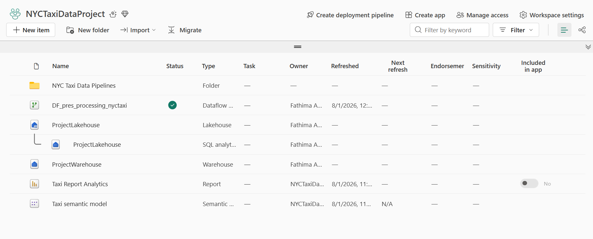
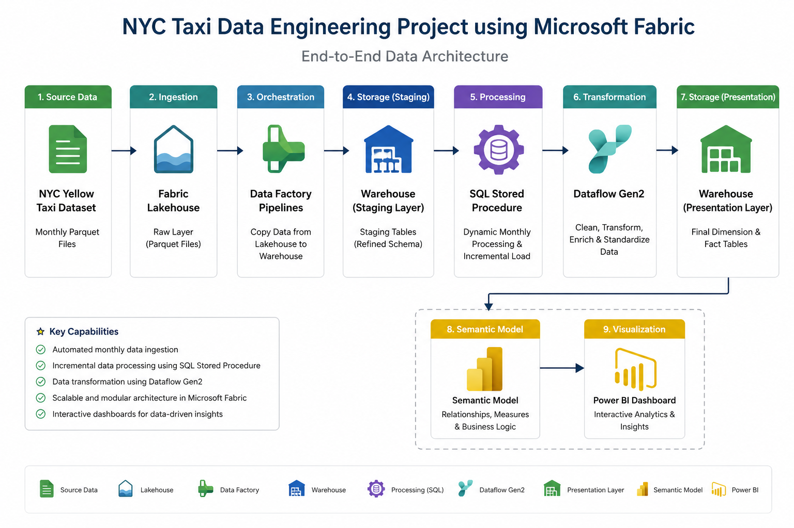
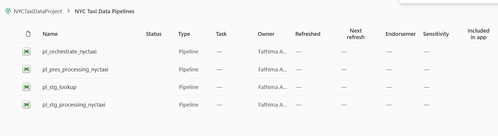
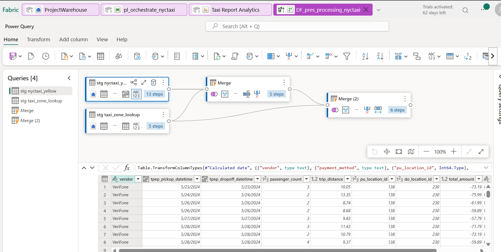
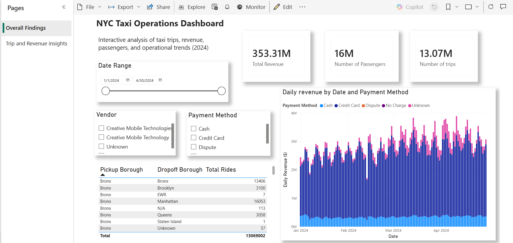
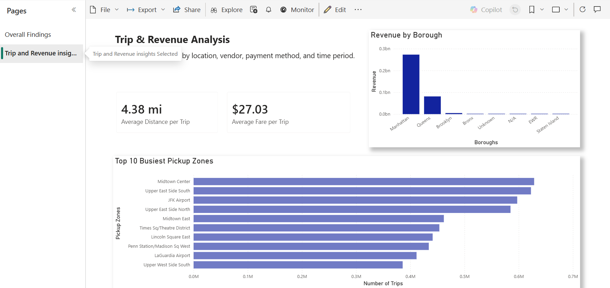

# 🚕 NYC Taxi Data Engineering Project using Microsoft Fabric

## 📖 Overview

This project demonstrates the design and implementation of an end-to-end data engineering solution using Microsoft Fabric. Monthly New York City Yellow Taxi trip data is ingested from Parquet files into a Fabric Lakehouse, processed through automated Data Factory pipelines, transformed using SQL stored procedures and Dataflow Gen2, loaded into a Fabric Data Warehouse, and visualized through an interactive Power BI dashboard.

The solution supports incremental monthly data processing, allowing newly available datasets to be appended to the presentation layer without reprocessing historical records. This project showcases core data engineering concepts including ETL orchestration, data transformation, automation, warehousing, semantic modeling, and business intelligence reporting.

## 🖥️ Microsoft Fabric Workspace Overview

The project was developed within a Microsoft Fabric workspace. The workspace includes the Lakehouse, Data Warehouse, Data Factory pipelines, Dataflow Gen2 transformations, Semantic Model, and Power BI reports, providing a unified platform for data ingestion, processing, storage, and visualization.

## 🏗️ Solution Architecture

The diagram below illustrates the end-to-end data flow implemented in Microsoft Fabric.

## ⚙️ Technology Stack

| Technology | Purpose |
|------------|---------|
| **Microsoft Fabric** | End-to-end data engineering platform |
| **Fabric Lakehouse** | Stores raw NYC Yellow Taxi Parquet files |
| **Data Factory Pipelines** | Automates data ingestion and orchestration |
| **SQL** | Data validation, filtering, and stored procedures |
| **Dataflow Gen2** | Data cleansing, transformation, and enrichment |
| **Fabric Data Warehouse** | Stores staging and presentation tables |
| **Semantic Model** | Provides a reporting layer for Power BI |
| **Power BI** | Interactive dashboard and business intelligence reporting |
| **Parquet Files** | Raw data storage format |

## 📊 Dataset

This project uses the **New York City Yellow Taxi Trip Records** dataset published by the NYC Taxi & Limousine Commission (TLC) - https://www.nyc.gov/site/tlc/about/tlc-trip-record-data.page. The dataset contains monthly trip-level information including pickup and dropoff timestamps, passenger counts, trip distances, fares, payment methods, and pickup/dropoff locations. It has the following data dictionary as well : https://www.nyc.gov/assets/tlc/downloads/pdf/data_dictionary_trip_records_yellow.pdf.

Each monthly dataset is stored in **Parquet** format and ingested into Microsoft Fabric for automated processing.

# 🔄 Project Workflow

## 1️⃣ Data Ingestion

Monthly NYC Yellow Taxi datasets and the Taxi Zone Lookup table are uploaded into a Fabric Lakehouse. The Lakehouse acts as the raw storage layer for all incoming data before processing begins.

---

## 2️⃣ Data Pipeline Orchestration

Multiple Data Factory pipelines were developed to automate the ETL workflow.

- **pl_stg_lookup** loads the Taxi Zone Lookup table into the staging layer.
- **pl_stg_processing_nyctaxi** copies raw taxi trip data into warehouse staging tables.
- **pl_pres_processing_nyctaxi** processes staging data into presentation tables.
- **pl_orchestrate_nyctaxi** orchestrates the complete workflow by executing all pipelines in sequence.

---

## 3️⃣ SQL Stored Procedures

A SQL stored procedure was implemented to support dynamic monthly processing.

Pipeline variables automatically determine the processing window by defining the start and end dates for each execution. This ensures that only the required month's records are processed while preventing duplicate processing of historical data.

---

## 4️⃣ Data Transformation using Dataflow Gen2

Dataflow Gen2 was used to prepare the analytical dataset before loading it into the presentation layer.

Transformations included:

- Data cleansing
- Data type corrections
- Query transformations
- Joining taxi trip data with Taxi Zone Lookup data
- Creating presentation-ready tables for reporting

---

## 5️⃣ Data Warehouse

The transformed data is loaded into the Fabric Data Warehouse where it is organised into staging and presentation layers. Presentation tables serve as the source for reporting and analytics.

---

## 6️⃣ Semantic Model

A Fabric Semantic Model exposes the presentation tables for reporting, enabling Power BI to efficiently query and visualize the processed data.

---

## 7️⃣ Power BI Dashboard

An interactive Power BI dashboard was created to analyse NYC taxi operations.

The dashboard includes:

- Total Revenue
- Number of Trips
- Total Passengers
- Average Fare per Trip
- Average Trip Distance
- Revenue by Borough
- Top 10 Pickup Zones
- Revenue Trends
- Interactive Vendor, Payment Method and Date filters

### Executive Dashboard

### Operational Insights

---

# ✨ Key Features

- End-to-end Microsoft Fabric implementation
- Automated ETL pipeline orchestration
- Dynamic SQL stored procedures using pipeline variables
- Incremental monthly data processing
- Data transformation using Dataflow Gen2
- Fabric Data Warehouse with staging and presentation layers
- Interactive Power BI dashboard with KPI reporting
- Semantic Model integration for analytics

---

# 📚 Skills Demonstrated

- Microsoft Fabric
- Data Engineering
- ETL Pipeline Development
- Data Factory Pipelines
- Fabric Lakehouse
- Fabric Data Warehouse
- SQL
- SQL Stored Procedures
- Dataflow Gen2
- Data Transformation
- Data Cleaning
- Incremental Data Loading
- Pipeline Orchestration
- Power BI
- Semantic Modeling
- Business Intelligence
- Parquet Data Processing

---

# 🚀 Future Improvements

Potential enhancements include:

- Automating ingestion directly from the NYC Taxi public dataset.
- Implementing execution logging and monitoring for pipeline runs.
- Adding advanced Power BI analytics such as trip demand forecasting.
- Incorporating additional taxi datasets (Green Taxi, FHV and High Volume FHV).
- Implementing Slowly Changing Dimensions (SCD) for historical tracking

---

## 🎯 What I Learned

Through this project, I gained hands-on experience with Microsoft's modern data engineering platform and developed practical skills in:

- Designing end-to-end ETL workflows using Microsoft Fabric
- Building and orchestrating Data Factory pipelines
- Implementing dynamic SQL stored procedures with pipeline variables
- Transforming and enriching data using Dataflow Gen2
- Working with Lakehouse and Data Warehouse architectures
- Developing interactive Power BI dashboards using Semantic Models
- Applying incremental data processing concepts to automate monthly data ingestion
